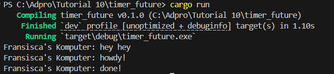

# REFLEKSI
## Fransisca Ellya Bunaren - 2306152286
### TUTORIAL

### TIMER

Output yang didapatkan adalah 
* `Fransisca's Komputer: hey hey`
* `Fransisca's Komputer: howdy!`
* `Fransisca's Komputer: done!`

Hal ini terjadi karena `hey hey` dicetak langsung di main sebelum executor dijalankan. Setelah itu, executor menjalankan task async yang mencetak `howdy!`, lalu berhenti sejenak karena await TimerFuture. Setelah timer selesai (2 detik), task dilanjutkan dan mencetak `done!`